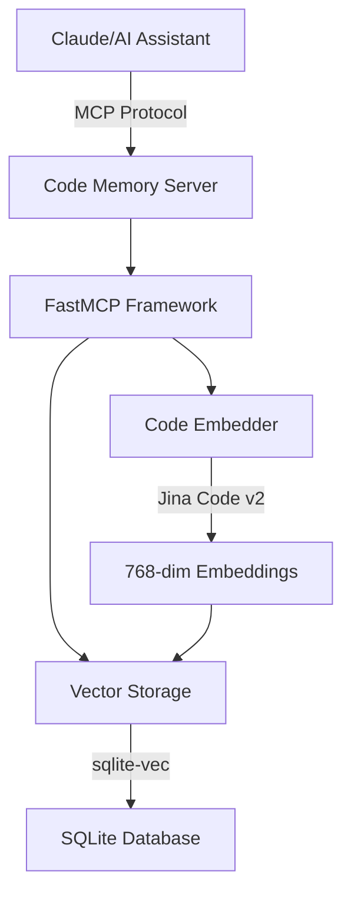

# 🧠 MCP Code Memory Server

[](https://www.python.org/downloads/)
[](https://github.com/modelcontextprotocol/python-sdk)
[](https://opensource.org/licenses/MIT)


A lightweight MCP (Model Context Protocol) server that provides persistent memory for AI coding assistants. Store and retrieve code snippets using natural language queries across sessions.

## 🌟 Features

- **🔍 Semantic Code Search**: Find code snippets using natural language descriptions
- **💾 Persistent Memory**: Code discoveries survive across sessions
- **🚀 Fast Vector Search**: Powered by sqlite-vec for millisecond query times
- **🌐 30+ Languages**: Support for Python, JavaScript, Java, Go, Rust, and more
- **🎯 Smart Embeddings**: Uses Jina's code-specific embedding model for high accuracy
- **📊 Usage Analytics**: Track which code snippets are accessed most frequently
- **🔧 Easy Integration**: Works seamlessly with Claude Desktop and other MCP clients

## 🎥 Demo


*Storing and retrieving code snippets across Claude sessions*

## 🚀 Quick Start

### Prerequisites

- Python 3.12 or higher
- 2GB of free disk space (for model downloads)
- (Optional) CUDA-capable GPU for faster embeddings

### Installation

```bash
# Clone the repository
git clone https://github.com/yourusername/mcp-code-memory
cd mcp-code-memory

# Install with pip
pip install -e .

# Or use uv for faster installation
uv pip install -e .
```

### Basic Usage

1. **Start the server**:
```bash
python -m code_memory
```

2. **Configure Claude Desktop**:

Add to your `claude_desktop_config.json`:

```json
{
  "mcpServers": {
    "code-memory": {
      "command": "python",
      "args": ["-m", "code_memory"],
      "env": {
        "DATABASE_PATH": ".ai/code_memory.db"
      }
    }
  }
}
```

3. **Use in Claude**:
```
Claude: "Remember this authentication function at auth.py:45-120"
Claude: "Where did we implement JWT token validation?"
```

## 📖 Documentation

### Available MCP Tools

#### `store_code_snippet`
Store a code snippet with semantic embedding for later retrieval.

**Parameters:**
- `code` (string, required): The code snippet to store
- `language` (string, required): Programming language (e.g., "python", "javascript")
- `description` (string, required): Natural language description of what the code does
- `tags` (array, optional): List of tags for categorization

**Example:**
```json
{
  "code": "def authenticate(token):\n    return jwt.verify(token, SECRET_KEY)",
  "language": "python",
  "description": "JWT token authentication function",
  "tags": ["auth", "jwt", "security"]
}
```

#### `search_code`
Search for similar code snippets using natural language queries.

**Parameters:**
- `query` (string, required): Natural language search query
- `language` (string, optional): Filter by programming language
- `limit` (integer, optional): Maximum results to return (default: 5)

**Example:**
```json
{
  "query": "function to validate user tokens",
  "language": "python",
  "limit": 3
}
```

#### `list_languages`
Get a list of all programming languages with stored snippets.

#### `get_snippet_by_id`
Retrieve a specific code snippet by its ID.

### Database Location

By default, the code memory database is stored in `.ai/code_memory.db` within your project directory. This design:

- **Keeps data organized**: All AI-related data in one place
- **Enables portability**: Easy to backup or transfer your code knowledge
- **Respects HuggingFace caching**: Uses standard HF Hub cache for models
- **Version control friendly**: Database files are git-ignored but directory structure is tracked

You can override the location using the `DATABASE_PATH` environment variable. The server will automatically create the directory structure if it doesn't exist:

```bash
# Custom location - directories will be created automatically
export DATABASE_PATH="/path/to/your/custom/database.db"

# Or relative to project
export DATABASE_PATH="data/memories/code_snippets.db"
```

The `.ai/` directory structure:
```
.ai/
├── README.md           # Documentation about the data directory
├── code_memory.db      # SQLite database with vector embeddings
└── cache/              # Application-specific cache (if needed)
```

### Configuration

Environment variables:

| Variable | Description | Default |
|----------|-------------|---------|
| `DATABASE_PATH` | Path to SQLite database | `.ai/code_memory.db` |
| `EMBEDDING_MODEL` | HuggingFace model name | `jinaai/jina-embeddings-v2-base-code` |
| `EMBEDDING_DEVICE` | Device for embeddings (auto/cpu/cuda) | `auto` |
| `EMBEDDING_BATCH_SIZE` | Embedding batch size | `32` |
| `MAX_SEQUENCE_LENGTH` | Max tokens per snippet | `8192` |
| `LOG_LEVEL` | Logging level | `INFO` |

## 🏗️ Architecture



### Components

- **FastMCP**: High-level Python framework for MCP servers
- **Jina Embeddings**: Code-specific embedding model (768 dimensions)
- **sqlite-vec**: Vector similarity search extension for SQLite
- **Async Architecture**: Non-blocking operations for better performance

## 🔧 Development

### Setup Development Environment

```bash
# Clone the repository
git clone https://github.com/yourusername/mcp-code-memory
cd mcp-code-memory

# Create virtual environment
python -m venv venv
source venv/bin/activate  # On Windows: venv\Scripts\activate

# Install in development mode
pip install -e ".[dev]"

# Run tests
pytest
```

### Running Tests

```bash
# Run all tests
pytest

# Run with coverage
pytest --cov=code_memory --cov-report=html

# Run specific test
pytest tests/test_embeddings.py::test_code_similarity
```

### Code Style

We use `black` for code formatting and `ruff` for linting:

```bash
# Format code
black src/ tests/

# Run linter
ruff check src/ tests/

# Type checking
mypy src/
```

## 📊 Performance

### Benchmarks

| Operation | Time | Notes |
|-----------|------|-------|
| Store snippet | ~50ms | Including embedding generation |
| Search (10K snippets) | ~10ms | Using vector index |
| Search (100K snippets) | ~100ms | With language filter |
| Embedding generation | ~30ms | Per snippet (CPU) |
| Embedding generation | ~5ms | Per snippet (GPU) |

### Storage Requirements

- ~3KB per code snippet (including embedding)
- Binary quantization available for 32x compression
- SQLite WAL mode for concurrent access

## 🐛 Troubleshooting

### Common Issues

**1. Model download fails**
```bash
# Manually download model
python -c "from sentence_transformers import SentenceTransformer; SentenceTransformer('jinaai/jina-embeddings-v2-base-code')"
```

**2. SQLite vec extension not found**
```bash
# Reinstall sqlite-vec
pip install --force-reinstall sqlite-vec
```

**3. Out of memory errors**
```bash
# Reduce batch size
export BATCH_SIZE=16
```

### Debug Mode

Enable detailed logging:
```bash
export LOG_LEVEL=DEBUG
python -m code_memory
```

## 🤝 Contributing

We welcome contributions! Please see our [Contributing Guide](CONTRIBUTING.md) for details.

1. Fork the repository
2. Create your feature branch (`git checkout -b feature/amazing-feature`)
3. Commit your changes (`git commit -m 'Add some amazing feature'`)
4. Push to the branch (`git push origin feature/amazing-feature`)
5. Open a Pull Request

## 📄 License

This project is licensed under the MIT License - see the [LICENSE](LICENSE) file for details.

## 🙏 Acknowledgments

- [Anthropic](https://anthropic.com) for the Model Context Protocol
- [Jina AI](https://jina.ai) for the excellent code embedding model
- [Alex Garcia](https://alexgarcia.xyz) for sqlite-vec
- The MCP community for inspiration and examples

## 📚 Citations

If you use this project in your research, please cite:

```bibtex
@software{mcp-code-memory,
  title = {MCP Code Memory Server},
  author = {Your Name},
  year = {2024},
  url = {https://github.com/yourusername/mcp-code-memory}
}
```

## 🔗 Related Projects

- [MCP Servers](https://github.com/modelcontextprotocol/servers) - Official MCP server examples
- [FastMCP](https://github.com/jlowin/fastmcp) - The Python framework we use
- [sqlite-vec](https://github.com/asg017/sqlite-vec) - Vector search for SQLite

---

<p align="center">
  Made with ❤️ for the AI coding community
</p>